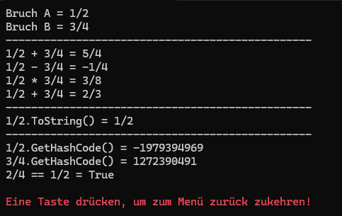

# Beispiel zu Operatorenüberladung


]

Beispielprogramm zu Operatorenüberlaung in C# für das Bruchrechnen.

</br>

```csharp
Bruch a = new Bruch(1, 2);
Bruch b = new Bruch(3, 4);

Console.WriteLine($"Bruch A = {a.ToString()}");
Console.WriteLine($"Bruch B = {b.ToString()}");
Console.WriteLine("------------------------------------------------");
Console.WriteLine($"1/2 + 3/4 = {a + b}"); // 5/4
Console.WriteLine($"1/2 - 3/4 = {a - b}"); // -1/4
Console.WriteLine($"1/2 * 3/4 = {a * b}"); // 3/8
Console.WriteLine($"1/2 + 3/4 = {a / b}"); // 2/3
Console.WriteLine("------------------------------------------------");
Console.WriteLine($"1/2.ToString() = {a.ToString()}");
Console.WriteLine("------------------------------------------------");
Console.WriteLine($"1/2.GetHashCode() = {a.GetHashCode()}");
Console.WriteLine($"3/4.GetHashCode() = {b.GetHashCode()}");

bool isEqual = new Bruch(2, 4) == new Bruch(1, 2);
Console.WriteLine($"2/4 == 1/2 = {isEqual}");
```

